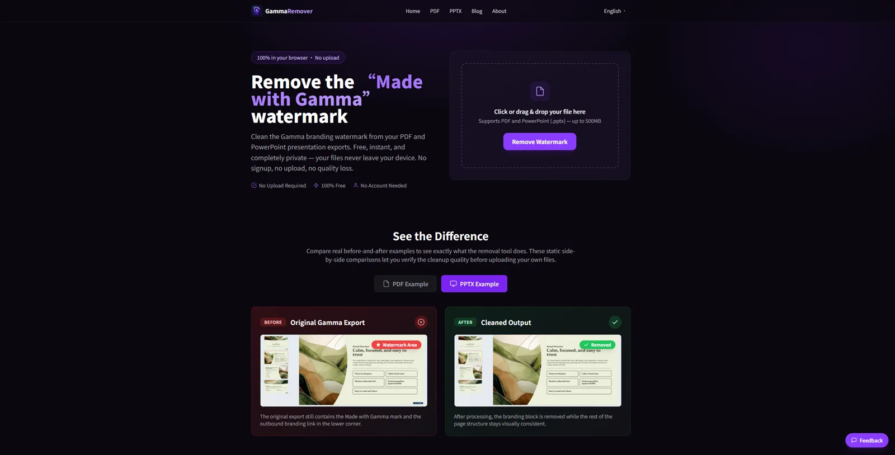

[English](README.md) | [简体中文](README.zh-CN.md) | [Русский](README.ru.md) | [Português](README.pt-BR.md) | [Español](README.es.md) | [日本語](README.ja.md) | [한국어](README.ko.md) | [Français](README.fr.md) | [Deutsch](README.de.md)

# Awesome AI Export Cleaners

A curated list of tools, guides, and workflow notes for cleaning exported files from AI-assisted content platforms.

This repository is a practical resource directory for document, slide, PDF, and generated study-material cleanup workflows. Use only for files you own or have permission to modify.

## Preview

## Contents

- [Featured Tools](#featured-tools)
- [Tool Directory](#tool-directory)
- [Supported Formats](#supported-formats)
- [Common Use Cases](#common-use-cases)
- [Categories](#categories)
- [Guides](#guides)
- [Repository Structure](#repository-structure)
- [Selection Criteria](#selection-criteria)
- [Responsible Use](#responsible-use)
- [Related Projects](#related-projects)
- [Disclaimer](#disclaimer)

## Featured Tools

### GammaRemover

[GammaRemover](https://gammaremover.com/) is an independent browser-based Gamma export cleaner for PDF and PowerPoint files. It can help clean visible "Made with Gamma" branding from standard Gamma exports where supported. Use only for files you own or have permission to modify.

Best for:

- Gamma-exported PDFs
- Gamma-exported PowerPoint files
- Browser-based document cleanup without installing desktop software

### NotebookLMRemover

[NotebookLMRemover](https://notebooklmremover.org/) is an independent NotebookLM export helper with tools and guides for NotebookLM-related workflows, generated materials, and browser-based cleanup use cases. Use only for files you own or have permission to modify.

Best for:

- NotebookLM-related export workflows
- Generated study materials and notes
- Learning how to prepare AI-assisted materials for personal or team use

## Tool Directory

| Tool | Platform | Supported formats | Browser-based | Best for | Link |
| --- | --- | --- | --- | --- | --- |
| GammaRemover | Gamma exports | PDF, PPTX | Yes | Cleaning your own Gamma PDF and PowerPoint exports | [GammaRemover](https://gammaremover.com/) |
| NotebookLMRemover | NotebookLM workflows | Study materials, generated notes, workflow guides | Yes | Organizing NotebookLM-related export workflows | [NotebookLMRemover](https://notebooklmremover.org/) |
| Community guides / workflow notes | General AI export workflows | PDF, PPTX, documents, study materials | Varies | Understanding cleanup choices before editing files | Local docs in this repository |

## Supported Formats

| Format or workflow | What this repository covers | Notes |
| --- | --- | --- |
| PDF exports | Cleanup notes for exported documents | Results depend on how the PDF was generated. |
| PowerPoint / PPTX exports | Slide-deck cleanup notes and review workflows | PPTX files may expose editable slide objects. |
| Generated study materials | Notes, summaries, and source-based learning files | Review accuracy before sharing. |
| AI-generated documents | General document cleanup and review practices | Keep source files and change history where possible. |
| Browser-based cleanup workflows | Tools that run without desktop installation | Check files locally before uploading anywhere. |
| Export workflow guides | Practical notes for choosing the right workflow | Prefer supported official export settings when needed. |

## Common Use Cases

- Cleaning visible branding from your own Gamma PDF export.
- Preparing Gamma PPTX files for review or internal presentation drafts.
- Organizing NotebookLM-generated study materials before sharing with a team.
- Keeping original files before cleanup so changes can be checked or reversed.
- Reviewing exported AI-generated documents before sending them to clients, classmates, or collaborators.
- Understanding PDF vs PPTX cleanup differences before choosing a workflow.
- Comparing browser-based cleanup tools with manual document editing.
- Creating a simple export checklist for repeatable team workflows.

## Categories

### Gamma Export Cleanup

- [PDF export cleanup](https://gammaremover.com/en/pdf/) - a focused Gamma PDF cleanup workflow for exported documents.
- [PowerPoint export cleanup](https://gammaremover.com/en/pptx/) - a Gamma PPTX cleanup option for slide decks and presentation files.

### NotebookLM Export Workflows

- Browser-based helpers for cleaning or preparing NotebookLM-related exports.
- Workflow notes for generated study materials, summaries, and source-based documents.

### General AI Export Hygiene

- Keep original source files before editing exports.
- Review cleaned files manually before sharing them.
- Preserve attribution, licensing, and permission requirements for any material you did not create.

## Guides

- [Cross-tool AI export cleanup guide](https://gammaremover.com/en/blog/remove-ai-tool-watermarks-guide/) - a practical overview for cleaning exported AI-generated files across common formats.
- [NotebookLM export workflow guide](https://notebooklmremover.org/blog/remove-ai-tool-watermarks-guide/) - a NotebookLM-oriented guide for preparing generated materials and related exports.

## Repository Structure

- [Gamma export cleanup notes](docs/gamma-export-cleanup.md)
- [NotebookLM export workflows](docs/notebooklm-export-workflows.md)
- [PDF and PPTX cleanup notes](docs/pdf-pptx-cleanup-notes.md)
- [Responsible use](docs/responsible-use.md)
- [Tool data](data/tools.json)
- [Contributing guide](CONTRIBUTING.md)

## Selection Criteria

Resources should be:

- Useful for legitimate document, slide, or study-material cleanup workflows.
- Clear about supported file formats and platform scope.
- Independent when they are not official tools from the platform being discussed.
- Respectful of ownership, permissions, and applicable platform terms.

## Responsible Use

- Only use tools for files you own or have permission to modify.
- Do not use cleanup tools to misrepresent authorship.
- Do not violate platform terms, copyright, or licensing rules.
- Use official paid export options when you need fully supported platform-approved watermark-free exports.
- This repository is not affiliated with Gamma, NotebookLM, Google, or any other platform mentioned.

## Related Projects

- Gamma PDF/PPTX cleanup tool - browser-based cleanup for Gamma exports.
- NotebookLM workflow guide site - NotebookLM export workflow and cleanup resources.

## Contributing

Pull requests are welcome for tools, guides, and workflows that fit this list. Please include a short description, supported formats, and any relevant permission or platform-scope notes.

## Disclaimer

This repository is not affiliated with Gamma, NotebookLM, Google, or any other platform mentioned.

Use the resources listed here only for files you own or have permission to modify. This repository does not endorse misuse of third-party content, platform terms, or protected materials.
