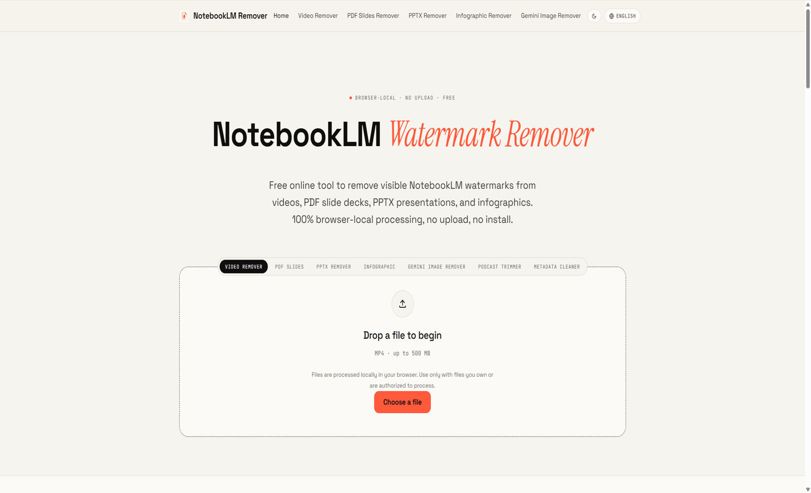

# PDF and PPTX Cleanup Notes

PDF and PPTX files often require different cleanup workflows because they store exported content in different ways.

## PDF Cleanup vs PPTX Cleanup

PDF cleanup usually focuses on fixed pages. Text, images, and shapes may be embedded into a layout that is designed to look the same everywhere. This makes PDFs reliable for sharing, but sometimes harder to edit.

PPTX cleanup usually focuses on slides and editable objects. Text boxes, images, and shapes may remain separate, which can make editing easier. The tradeoff is that fonts, spacing, and object positions may shift across editors.

## Why Results Vary by Export Structure

Cleanup results depend on how the source platform generated the file. Some exports keep text and shapes separate. Others flatten content into images or combine objects in ways that are difficult to edit cleanly.

Important factors include:

- whether text remains selectable;
- whether branding is a separate object or part of a flattened image;
- whether fonts are embedded or substituted;
- whether slide objects remain editable after export.

## Why Users Should Keep Original Files

Always keep original exports before editing. Original files make it easier to compare results, restore lost layout details, and prove where the material came from.

A simple workflow is:

1. Save the original export.
2. Make a cleanup copy.
3. Review the cleaned file manually.
4. Keep both versions when sharing with a team.

## Safe Browser-Based Cleanup Principles

- Use browser-based tools only for files you own or have permission to modify.
- Prefer tools that clearly explain supported formats.
- Avoid uploading sensitive files to services you do not trust.
- Review cleaned files before sharing or archiving them.
- Use official paid export options when you need fully supported platform-approved watermark-free exports.
